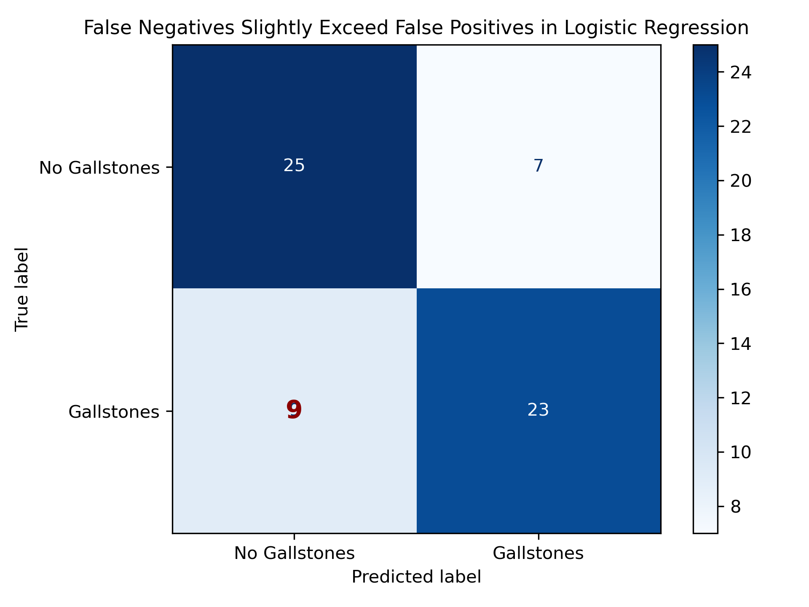
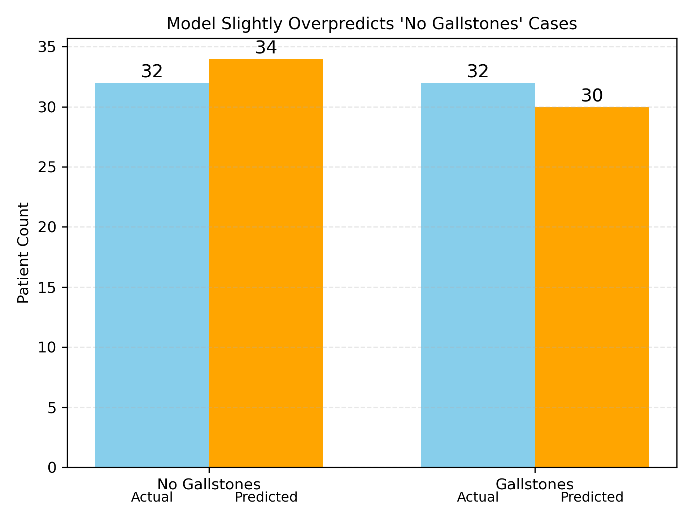
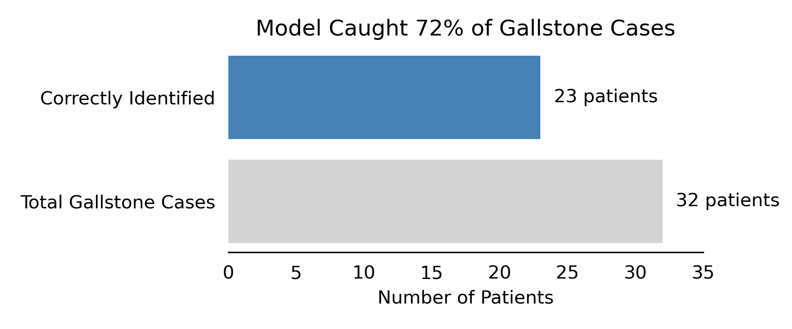

# Day 5: Results Dashboard

## 1. Objective
Assemble key charts from the gallstone prediction project to visually summarize model performance and outcomes.

## 2. Dashboard Charts
Below are selected visualizations with brief explanations.

### Chart 1: Confusion Matrix
(Model: Logistic Regression)
- **Insight:** False negatives slightly outnumber false positives, but overall classification performance is balanced.

---

### Chart 2: Actual vs Predicted Outcome Counts
- **Insight:** The model slightly overpredicts “No Gallstones,” suggesting a cautious diagnostic tendency.

---

### Chart 3: Stakeholder View – Gallstone Detection
- **Insight:** The model correctly identified 23 out of 32 patients with gallstones, detecting ~72% of true cases.

---

## 3. Summary
- The model demonstrates moderate diagnostic power, with a small tendency to underpredict gallstone presence.
- Most clinical cases are identified correctly, with acceptable error trade-offs.
- Charts were styled and annotated for both technical interpretation and stakeholder readability.