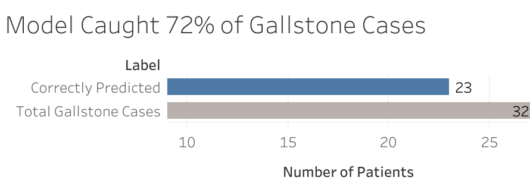

# Day 7: Visualization Tool Reflection

## Tool Used: Tableau Public  
## Chart Recreated: Stakeholder Bar – Gallstones Correctly Identified

### Screenshot or Link:

---

## Pros:
- Quick drag-and-drop interface
- Easy formatting of titles and labels
- Great for making interactive dashboards
- Good for stakeholder presentations

## Cons:
- Less flexible than Python for automation or customization
- Requires manual upload of data unless integrated
- Limited support for model-derived metrics or deeper ML integration

---

Overall, this exercise reinforced how interactive tools can complement Python for communication, but may be limited for complex data workflows. 